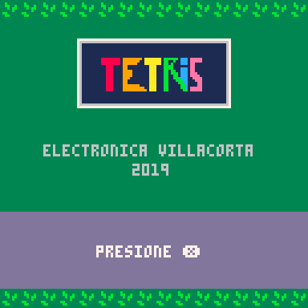
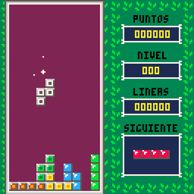

# PICO-8 Tetris Clone

## 📸 Capturas de Pantalla

¡Un clon funcional del clásico Tetris desarrollado para la consola de fantasía **PICO-8** utilizando **Lua**!

## 📸 Demostración
🎮 [HAZ CLIC AQUÍ PARA JUGAR DESDE TU NAVEGADOR](https://electronicajlv.github.io/pico8-tetris/game.html)

## 🛠️ Características y Retos Técnicos Solucionados
* **Matriz de Juego:** Implementación de una grilla bidimensional para controlar el estado del tablero, la caída de las piezas y la detección de líneas completas.
* **Sistema de Rotación:** Programación de la lógica matemática para rotar las piezas (Tetrominos) asegurando que no colisionen con las paredes del escenario (Wall Kicks básicos).
* **Restricciones de PICO-8:** El juego fue optimizado a nivel de código para mantenerse dentro de los límites estrictos de tokens y memoria que impone la plataforma.

## 🚀 Cómo ejecutarlo localmente
1. Descarga el archivo `mytetris.p8`.
2. Abre tu consola PICO-8.
3. Ejecuta el comando `load mytetris.p8` y luego `run`.

## 🎮 Controles
* **Flechas Izquierda / Derecha:** Mover pieza.
* **Flecha Abajo:** Caída rápida.
* **Z / X:** Rotar pieza.
